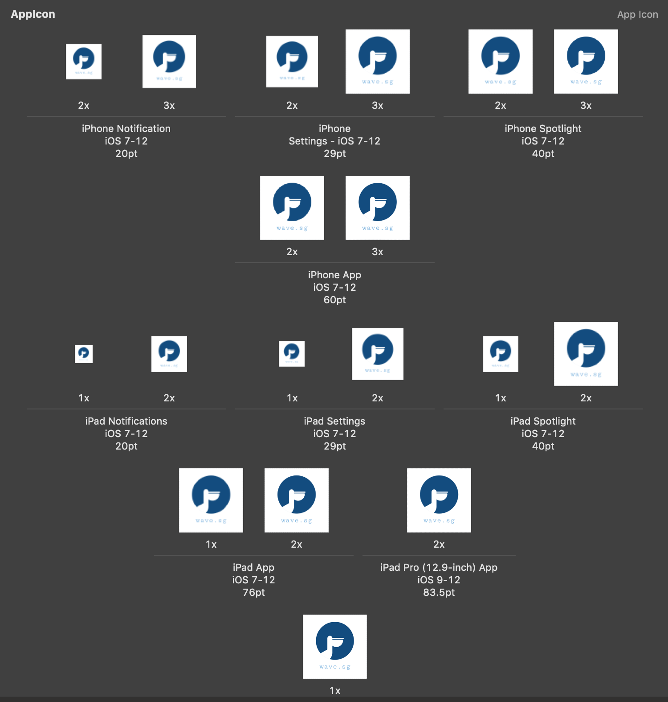

# square
🖼 An iOS app icon resizing tool written in rust

Square is a small tool to export and resize an an app icon into iOS required dimensions.

### How to run

```
square <URL>
```
Will export all images into `output/` folders, all named after their own dimensions.



### Dimension supported

* App Store 
* iPad Pro 12.9in App @2x
* iPad App iOS 7-12
* iPad Spotlight iOS 7-12
* iPad Settings iOS 7-12
* iPad Notifications
* iPhone App iOS 7-12
* iPhone Spotlight iOS 7-12
* iPhone Settings iOS 7-12
* iPhone Notifications

